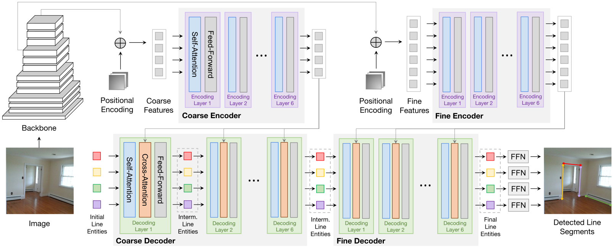

# LETR: Line Segment Detection Using Transformers without Edges

## Introduction 
This repository contains the official code and pretrained models for [Line Segment Detection Using Transformers without Edges](https://arxiv.org/abs/2101.01909). [Yifan Xu*](https://yfxu.com/), [Weijian Xu*](https://weijianxu.com/), [David Cheung](https://github.com/sawsa307), and [Zhuowen Tu](https://pages.ucsd.edu/~ztu/). CVPR2021 (**Oral**)

In this paper, we present a joint end-to-end line segment detection algorithm using Transformers that is post-processing and heuristics-guided intermediate processing (edge/junction/region detection) free. Our method, named LinE segment TRansformers (LETR), takes advantages of having integrated tokenized queries, a self-attention mechanism, and encoding-decoding strategy within Transformers by skipping standard heuristic designs for the edge element detection and perceptual grouping processes. We equip Transformers with a multi-scale encoder/decoder strategy to perform fine-grained line segment detection under a direct endpoint distance loss. This loss term is particularly suitable for detecting geometric structures such as line segments that are not conveniently represented by the standard bounding box representations. The Transformers learn to gradually refine line segments through layers of self-attention. 




## Changelog
05/07/2021: Code for LETR Basic Usage [Demo](https://github.com/mlpc-ucsd/LETR/blob/master/src/demo_letr.ipynb) are released. 

04/30/2021: Code and pre-trained checkpoint for LETR are released. 

## Results and Checkpoints


| Name | sAP10 | sAP15 | sF10 | sF15 | URL|
| --- | --- | --- | --- | --- |--- |
| Wireframe | 65.6 | 68.0 | 66.1 | 67.4 | [LETR-R101](https://vcl.ucsd.edu/letr/checkpoints/res101/res101_stage2_focal.zip) |
| YorkUrban | 29.6 | 32.0 | 40.5 | 42.1 | [LETR-R50](https://vcl.ucsd.edu/letr/checkpoints/res50/res50_stage2_focal.zip) |

## Reproducing Results

### Step1: Code Preparation
```bash
git clone https://github.com/mlpc-ucsd/LETR.git
```

### Step2: Environment Installation

```bash
mkdir -p data
mkdir -p evaluation/data
mkdir -p exp


conda create -n letr python anaconda
conda activate letr
conda install -c pytorch pytorch torchvision
conda install cython scipy
pip install -U 'git+https://github.com/cocodataset/cocoapi.git#subdirectory=PythonAPI'
pip install docopt
```

### Step3: Data Preparation
To reproduce our results, you need to process two datasets, [ShanghaiTech](https://github.com/huangkuns/wireframe) and [YorkUrban](https://www.elderlab.yorku.ca/resources/york-urban-line-segment-database-information/). Files located at ./helper/wireframe.py and ./helper/york.py are both modified based on the code from [L-CNN](https://github.com/zhou13/lcnn), which process the raw data from download.

- ShanghaiTech Train Data
    - To Download (modified based on from [L-CNN](https://github.com/zhou13/lcnn))
        ```bash
        cd data
        bash ../helper/gdrive-download.sh 1BRkqyi5CKPQF6IYzj_dQxZFQl0OwbzOf wireframe_raw.tar.xz
        tar xf wireframe_raw.tar.xz
        rm wireframe_raw.tar.xz
        python ../helper/wireframe.py ./wireframe_raw ./wireframe_processed

        ```
- YorkUrban Train Data
    - To Download  
        ```bash
        cd data
        wget https://www.dropbox.com/sh/qgsh2audfi8aajd/AAAQrKM0wLe_LepwlC1rzFMxa/YorkUrbanDB.zip
        unzip YorkUrbanDB.zip 
        python ../helper/york.py ./YorkUrbanDB ./york_processed
        
        ```
- Processed Evaluation Data
    ```bash
    bash ./helper/gdrive-download.sh 1T4_6Nb5r4yAXre3lf-zpmp3RbmyP1t9q ./evaluation/data/wireframe.tar.xz
    bash ./helper/gdrive-download.sh 1ijOXv0Xw1IaNDtp1uBJt5Xb3mMj99Iw2 ./evaluation/data/york.tar.xz
    tar -vxf ./evaluation/data/wireframe.tar.xz -C ./evaluation/data/.
    tar -vxf ./evaluation/data/york.tar.xz -C ./evaluation/data/.
    rm ./evaluation/data/wireframe.tar.xz
    rm ./evaluation/data/york.tar.xz
    ```

### Step4: Train Script Examples
1. Train a coarse-model (a.k.a. stage1 model).
    ```bash
    # Usage: bash script/*/*.sh [exp name]
    bash script/train/a0_train_stage1_res50.sh  res50_stage1 # LETR-R50  
    bash script/train/a1_train_stage1_res101.sh res101_stage1 # LETR-R101 
    ```

2. Train a fine-model (a.k.a. stage2 model).
    ```bash
    # Usage: bash script/*/*.sh [exp name]
    bash script/train/a2_train_stage2_res50.sh  res50_stage2  # LETR-R50
    bash script/train/a3_train_stage2_res101.sh res101_stage2 # LETR-R101 
    ```

3. Fine-tune the fine-model with focal loss (a.k.a. stage2_focal model).
    ```bash
    # Usage: bash script/*/*.sh [exp name]
    bash script/train/a4_train_stage2_focal_res50.sh   res50_stage2_focal # LETR-R50
    bash script/train/a5_train_stage2_focal_res101.sh  res101_stage2_focal # LETR-R101 
    ```

### Step5: Evaluation

1. Evaluate models.
    ```bash
    # Evaluate sAP^10, sAP^15, sF^10, sF^15 (both Wireframe and YorkUrban datasets).
    bash script/evaluation/eval_stage1.sh [exp name]
    bash script/evaluation/eval_stage2.sh [exp name]
    bash script/evaluation/eval_stage2_focal.sh [exp name]
    ```

### Citation

If you use this code for your research, please cite our paper:
```
@InProceedings{Xu_2021_CVPR,
    author    = {Xu, Yifan and Xu, Weijian and Cheung, David and Tu, Zhuowen},
    title     = {Line Segment Detection Using Transformers Without Edges},
    booktitle = {Proceedings of the IEEE/CVF Conference on Computer Vision and Pattern Recognition (CVPR)},
    month     = {June},
    year      = {2021},
    pages     = {4257-4266}
}
```
### Acknowledgments

This code is based on the implementations of [**DETR: End-to-End Object Detection with Transformers**](https://github.com/facebookresearch/detr). 
